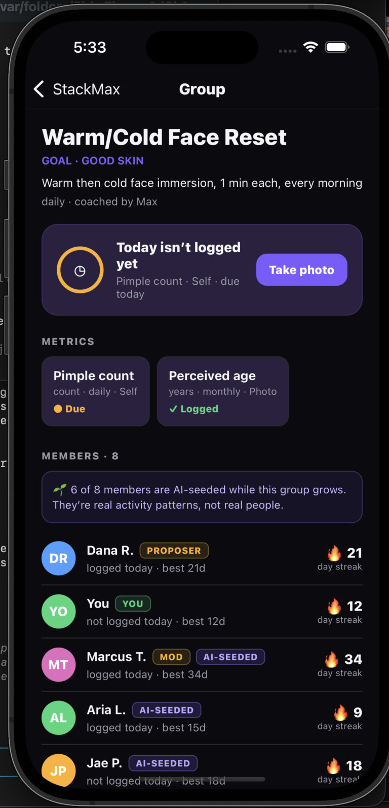

# ChooseYourProtocol — StackMax

**Choose a goal. Get a protocol. Prove it with a group that's already alive.**

> Tell an AI coach what you want to improve. It turns your fuzzy goal into a concrete **protocol** with measured metrics and a cadence, drops you into a **group** of people chasing the same thing, and holds you accountable with proof-of-work check-ins. When a brand-new group would otherwise be empty, it's seeded with clearly-labeled synthetic members so it feels alive from day one — and folds itself up honestly once no real people remain.

[chooseyourprotocol.com](https://chooseyourprotocol.com) · [About](https://chooseyourprotocol.com/about)

<p align="center">
  
</p>
<p align="center"><em>A live protocol group: metrics with proof tiers, streaks, and honestly-labeled AI-seeded members keeping the group alive until real ones join.</em></p>

---

## The problem

Habit and health apps track *numbers*. They don't create *accountability*.

- You log data into a void — no one's watching, so you quit.
- A brand-new community is a ghost town on day one, so nobody stays.
- "Am I actually making progress?" is hard to answer from a mirror or a single data point.

StackMax fixes the accountability layer: a coach that turns a goal into a real protocol, a group that's alive the moment you join, and an agent that observes your data, recommends one change, and names missed check-ins without shame.

---

## How it works

1. **Talk to the coach.** Tell Max a goal in plain language — "I want good skin," "I want to get stronger." The coach resolves it into a concrete **protocol group**: the metrics it will track, their units, cadence, and proof tier.
2. **Add it to your stack.** Accept the proposal and the group is created and added to *your stack* — the set of protocols you're running.
3. **The group is alive from day one.** A scout finds the matching problem space; the seeding engine populates a new group with **synthetic members** (clearly labeled `is_synthetic`, with provenance) so there's activity, streaks, and a feed before the first real user arrives.
4. **Log proof-of-work.** Post your metrics — a number, a note, or a photo. A capture flow measures visual proof (e.g. a skin macro) and the agent posts **check-in events** into the group feed.
5. **The accountability agent responds.** It observes exactly what changed, recommends one data-driven adjustment (often from a cohort-wide pattern), and tracks your check-in adherence against your declared protocol.
6. **Groups live and die honestly.** A group's life depends on its **real** member count — synthetics never keep it alive. When the last real member leaves, a synthetic-only group and its seeded members retire (an exception keeps freshly-seeded groups alive briefly so outreach can land the first real user).

---

## What it does

- 🧭 **Goal → protocol resolution** — an AI coach converts a fuzzy goal into measurable metrics, cadence, and proof tiers.
- 📚 **Your stack** — run multiple protocol groups at once and track streaks and milestones per group.
- 🌱 **Synthetic seeding (honest by design)** — new groups start alive with labeled synthetic members and stored provenance; nothing is ever passed off as a real person.
- 📸 **Proof-of-work capture** — log metrics with photos and notes; vision measures visual proof.
- 🤝 **Accountability agent** — OBSERVE / RECOMMEND / HOLD-ACCOUNTABLE check-ins that name plateaus and missed metrics without judgment, and never diagnose.
- ♻️ **Honest group lifecycle** — leave-group flow and all-synthetic teardown keyed to real member count.

---

## The accountability agent (behavior contract)

Every automated check-in follows a fixed shape, capped under 120 words:

- **OBSERVE** — exactly what changed in the quantitative and qualitative data since the last check-in. Raw data only; plateaus named honestly, no invented progress.
- **RECOMMEND** — one data-driven protocol adjustment today, tied to the observation or a cohort trend. A single action, never a list. Adjustments are logged with an explicit date.
- **HOLD ACCOUNTABLE** — names the cohort, tracks check-in adherence, logs milestones against the declared protocol. Missed metrics are named without shame; consistency is acknowledged plainly.

**Guardrails:** observe, never judge. Never diagnose or give unbacked medical advice — defer to the user's specialist for any lab trend and stop.

---

## Honesty guardrails for synthetic users (non-negotiable)

- Every synthetic member and generated asset is stamped `is_synthetic = true` with stored provenance.
- Synthetic avatars/clips (via the Masky engine) run server-side only; the token never ships to a client.
- A synthetic member is never presented as a real person — labeled in-app and in Terms/Privacy.

---

## Architecture & stack

| Layer | Technology |
| --- | --- |
| **Web (marketing + app shell)** | Vite + React SPA on **AWS S3 + CloudFront**, domain via **Route53 / ACM**, provisioned with Terraform |
| **Mobile app** | **Expo / React Native** (Expo Router) — coach chat, your stack, group screen, capture flow |
| **Coach + group backend** | Node service: `/resolve` (goal→protocol), group detail/feed, `/log`, `/measure`, `/seed`, `/leave`, `/retire-synthetics` |
| **Vision + LLM** | Coach resolution and proof measurement via the platform LLM/vision API (deterministic fallback when unset, so demos never break) |
| **Synthetic seeding** | Server-side seeding engine + **Masky** for labeled synthetic avatars/clips |
| **Auth / data (web)** | **Firebase Auth** + **Cloud Firestore**, multi-tenant (project `chooseyourprotocol`) |
| **API (web)** | **AWS Lambda + API Gateway v2**, Firebase Admin SDK (credentials from **AWS SSM Parameter Store**) |
| **Infra / CI-CD** | **Terraform** + **GitHub Actions** (push to `main` deploys the site) |

**Flow at a glance:** coach chat → `/resolve` → protocol group → seed (alive) → log / capture proof → agent check-in → lifecycle (leave / teardown).

---

## Repository layout

```
.
├── mobile/       # Expo / React Native app (coach chat, stack, group, capture) + coach/group backend
│   ├── app/          # Expo Router screens: index (chat), stack, group/[id], capture/[groupId]
│   ├── src/          # components, screens, api client, theme, local storage
│   └── server/       # coach + group backend (resolve/log/measure/seed/leave/retire)
├── src/          # Vite + React web SPA (marketing site + app shell)
├── api/          # AWS Lambda handlers (API Gateway v2, Firebase Admin SDK)
├── server/       # local API server + Masky synthetic-seeding integration
├── terraform/    # Infrastructure-as-code (S3, CloudFront, Route53/ACM, Lambda, API GW)
├── docs/         # specs, integration references, and demo scenarios
├── scripts/      # helper and ops scripts
└── .github/      # GitHub Actions CI/CD
```

---

## Local development

### Web app
Requirements: Node.js 20+, npm, Firebase credentials for the `chooseyourprotocol` project.

```bash
npm install
npm run dev        # Vite SPA + local API together
```

### Mobile app (fastest path to your phone)
Requirements: Node 18+, the **Expo Go** app on your phone, both devices on the same Wi-Fi.

```bash
cd mobile
npm run demo       # installs deps (first run), starts the coach backend on :8787, launches Expo
```

Scan the QR code in **Expo Go**. Then: tell Max a goal → accept the protocol → land on **Your Stack**.

The coach uses the platform LLM when `KYLON_API_TOKEN` + `KYLON_API_BASE` are set, and a deterministic fallback otherwise, so the demo always works. See `mobile/README.md` and `mobile/server/README-backend.md` for the full contract.

---

## Deployment

Infrastructure is Terraform; app deploys ship through GitHub Actions.

```bash
cd terraform
terraform init
terraform apply
```

Once infrastructure exists, **pushing to `main`** triggers GitHub Actions to build and deploy the site to S3 + CloudFront and update the Lambda-backed API. Firebase Admin credentials and AWS deploy credentials are read from **AWS SSM Parameter Store** / repo secrets — no secrets live in the repo.

---

## Docs

- [`docs/hackathon-demo-scenarios.md`](docs/hackathon-demo-scenarios.md) — end-to-end demo scenarios for the Bay Builders Hackathon.
- [`docs/masky-skill.md`](docs/masky-skill.md) — Masky synthetic-avatar integration reference.
- `mobile/README.md`, `mobile/server/README-backend.md` — mobile app + coach/group backend contracts.

---

## Social media strategy

Our social growth engine is anchored to marquee, named protocols with a built-in audience — the first being **Taryn Southern's "Pinkprint Protocol."**

**The thesis:** Bryan Johnson's Blueprint has generated an enormous dataset on optimizing health for an aging *man*. But that playbook doesn't map cleanly onto women's biology. The open question — *how do we optimize health for women?* — is exactly the kind of shared problem space StackMax is built to own.

The **Pinkprint Protocol** is Taryn Southern's answer: a women-focused alternative to Blueprint. Users follow it by joining **her Protocol Group on StackMax**, where progress is tracked, measured, and shared with an accountability community.

**How this drives social:**
- **Named-creator protocols are the hook.** A recognizable person with an existing following (Taryn) gives each protocol a face, a story, and a reason to share — far more shareable than a generic tracker.
- **The content is the proof.** Progress photos, lab metrics, and scan data inside the group are native, credible social content — the community generates the posts, and StackMax amplifies them.
- **Join = follow.** Every piece of Pinkprint content routes to a single action: join Taryn's Protocol Group on StackMax and start tracking.

This is the template. Each future marquee protocol pairs a credible owner with a distinct, underserved problem space — and each becomes its own social channel.


---

## License

See repository for license details.

---

<p align="center"><strong>ChooseYourProtocol · StackMax</strong> — choose your goal, get your protocol, prove it together.</p>
